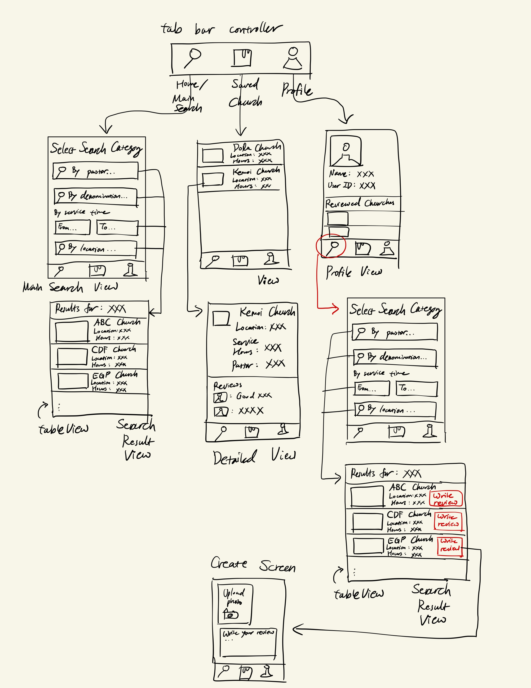

GoFindChurch
===

# GoFindChurch

## Table of Contents

1. [Overview](#Overview)
2. [Product Spec](#Product-Spec)
3. [Wireframes](#Wireframes)
4. [Schema](#Schema)

## Overview

### Description

[Also visible here](https://hackmd.io/@0yxRoGDhS1-989uKw4lOnw/r1KSGy87p)

When we travel different countries or visit different places, it is easy to get lost. One of the major things is finding your church. Especially if you follow a certain denomination or prefer late-night service times, it could be a major hassle to choose the right church for you. If you are a traveler, backpacker, or Christian digital nomad, you will feel what I mean. If you tend to plan things on the go, you will feel what I mean. I personally had trouble finding churches when I go to new places as I find myself being unable to find churches offering service in the afternoon in many major American cities. Well say no more, GoFindChurch has got your back! 

### App Evaluation

[Evaluation of your app across the following attributes]
- **Category:** religion, place finder
- **Mobile:** When we travel different countries or visit different places, it is easy to get lost. I personally had trouble finding churches when I go to new places as I find myself being unable to find churches offering service in the afternoon. Since many travelers and nomadic coders tend to plan things on the go, this app would be very useful for them to find churches last minute.
- **Story:** The audience is niche but also powerful. If a person follows a certain denomination, it would be challenging for him/her to find the church under that particular sect. Also, not all churches maintain their website, so it may be hard to figure out what the church would be like merely from web search.
- **Market:** The market would be pretty niche. The users would be predominantly Christian digial nomads, backpackers, or workers who visit a place short-term.
- **Habit:** The app would not form any habits because the purpose is to assist people with finding the churches they want or the pastors they want to follow.
- **Scope:** The app itself would use the preexisting church APIs which contains information about the sect, pastor, location, and service time of churches in different regions. It would be totally doable to complete this in two weeks. There are no apps that serve such a niche market need.

## Product Specification

### 1. User Stories (Required and Optional)

**Required Must-have Stories**

* User can search by location
* User can search by time range of service
* User can search by denomination
* User can search by pastor
* User can select a church and view more information by clicking the dropdown menu
* User can locally save his/her favorite church ID, denomination, or pastors

**Optional Nice-to-have Stories**

* User can create an account
* User can view/modify personal information
* User can sign in to post reviews about a church or pastor
* User can upload photos/videos in their reviews
* App can ask user to access current location while the user is actively using the app

### 2. Screen Archetypes

- [X] [Main Search Screen]
* [User can search by location]
* [User can search by time range of service]
* [User can search by denomination]
* [User can search by pastor]

- [ ] [Selected Church Screen]
* [User can select a church and view more information by clicking the dropdown menu]
* [User can locally save his/her favorite church ID, denomination, or pastors]

- [ ] [Register Screen]
* [User can create an account]

- [ ] [Sign-in Screen]
* [User can sign in to post reviews about a church or pastor]

- [ ] [Profile Screen]
* [User can view/modify personal information]

- [ ] [Create Screen]
* [User can post reviews under specific churches and pastors]

### 3. Navigation

**Tab Navigation** (Tab to Screen)

* [Home/Main Search Screen]
* [Saved Churches]
* [Profile]

**Flow Navigation** (Screen to Screen)

- [X] [Home/Main Search Screen]
* -> [Search by pastor]
* -> [Search by denomination]
* -> [Search by service time]
* -> [Search by location]

- [ ] [Selected Church Screen]
* -> [Main Search Screen]
* -> [Create Screen]

- [ ] [Registration Screen]
* -> [Sign-in Screen]

- [ ] [Sign-in Screen]
* -> [Profile]

- [ ] [Profile Screen]
* -> [Home/Main Search Screen]

- [ ] [Create Screen]
* -> [Home/Main Search Screen] (after posting the review)

## Wireframes

[Add picture of your hand sketched wireframes in this section]

### [BONUS] Digital Wireframes & Mockups

### [BONUS] Interactive Prototype

## Schema 

[This section will be completed in Unit 9]

### Models

[Add table of models]

### Networking

- [Add list of network requests by screen ]
    - http://calapi.inadiutorium.cz/api/v0/en/calendars/general-en/today: used to view what liturgical day today is
- [Create basic snippets for each Parse network request]
    - URLSession.shared.dataTask()
- [OPTIONAL: List endpoints if using existing API such as Yelp]

